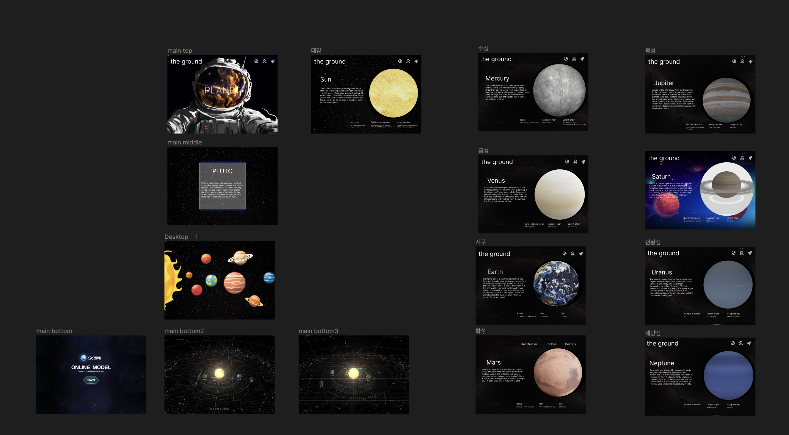
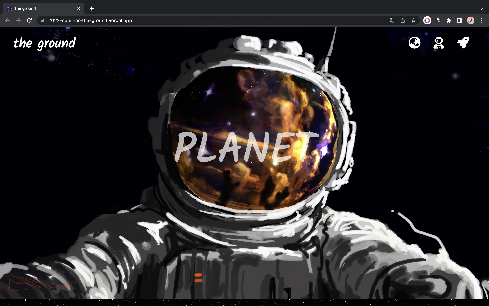

# THE GROUND

기간 2022.09.01 ~ 2022.09.27

[Figma 디자인 페이지](https://www.figma.com/file/3wGLCIlRaSFP0nBMuJjzpy/pluto?node-id=0%3A3)
[2022-seminar-the-ground](https://2022-seminar-the-ground.vercel.app/)  

## the-ground → [site](https://2022-seminar-the-ground.vercel.app/)

### 📝 Description

행성에 대한 정보를 쉽게 알려주는 사이트입니다.

**주요 기능 소개**
다양한 행성들의 특징과 구성, 우주에서의 위치에 대해 배울 수 있습니다. 어떤 행성은 지구와 비슷한 조건에서 살 수 있는 생명체가 존재할 만큼 기후적으로 적절한 환경을 가지고 있는 반면에 다른 행성들은 극한의 온도나 기압, 방사선 등으로 인해 인간이 살기에는 매우 극단적인 환경입니다. 이 사이트에서는 이와 같은 다양한 정보를 제공하며, 우주에 대한 관심과 이해를 높일 수 있도록 도와줍니다.

### 🔍 Preview

### **🧰 Tools**

Design: [Figma](https://www.figma.com/file/3wGLCIlRaSFP0nBMuJjzpy/pluto?node-id=0%3A3)

  
  
  
  

